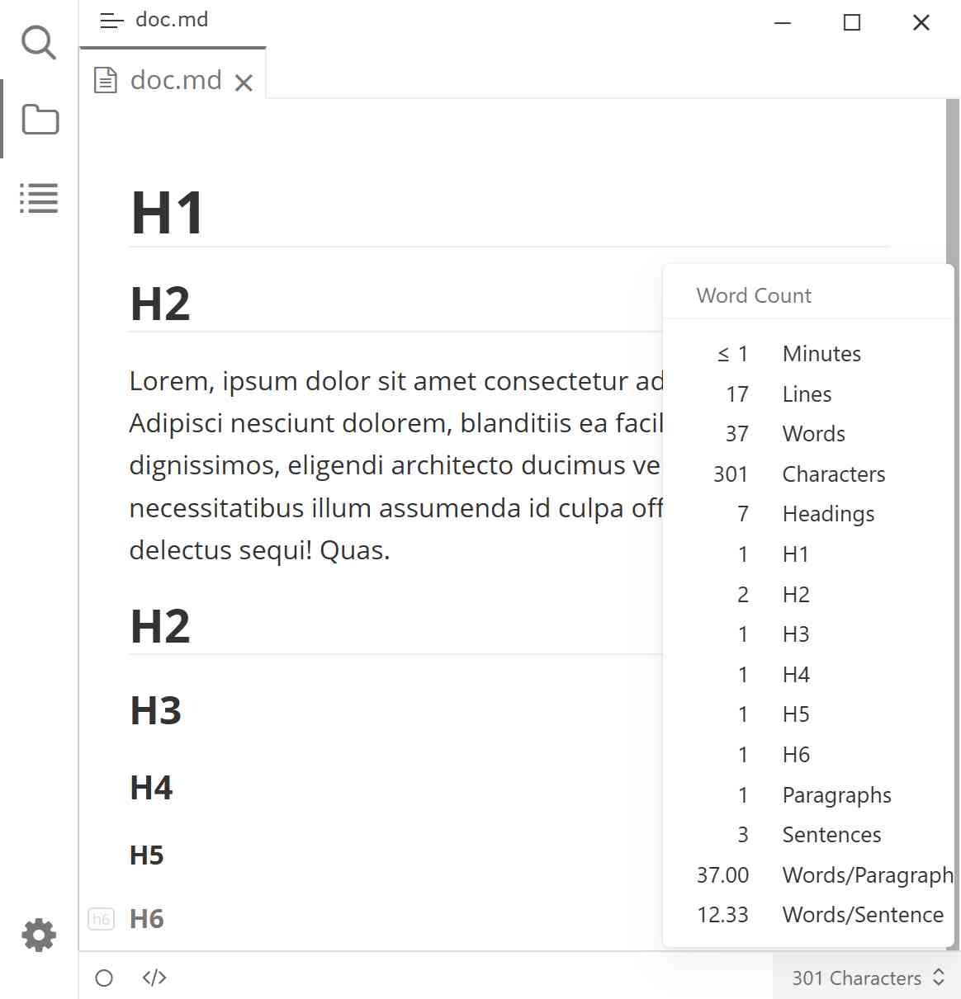

# Typora Plugin Statistics

English | [简体中文](./README.zh-CN.md)

This a plugin based on [typora-community-plugin](https://github.com/typora-community-plugin/typora-community-plugin) for [Typora](https://typora.io).

Display document statistics:

- Total headings and per-level breakdown (H1–H6);
- Number of non-empty paragraphs;
- Sentence count supporting both Western (. ! ?) and CJK (。！？…) delimiters;
- Average words per paragraph and average words per sentence.

All items can be independently toggled on/off in plugin settings.

## Preview

